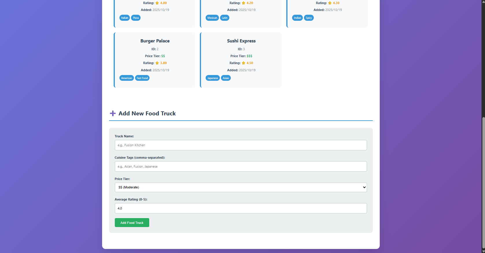

# RUEating - Food Truck Discovery Platform

RUEating is a food truck discovery and ordering platform designed to connect customers with local food trucks and enable vendors to manage their operations digitally. The system provides APIs for discovering nearby food trucks, browsing menus, placing orders, managing schedules, and tracking vendor activity.

## Quick Start

### Prerequisites
- Docker and Docker Compose installed
- Git (optional)

### 1. Start the Application
```bash
# Clone or download this project
# Navigate to the project directory

# Start both PostgreSQL and Node.js services
docker-compose up --build
```

### 2. Verify Services are Running
- **Database**: PostgreSQL on port 5432
- **API**: Node.js Express server on port 3000

### 3. Test the API

#### Health Check
```bash
curl http://localhost:3000/health
```

#### Get All Food Trucks
```bash
curl http://localhost:3000/trucks
```

#### Add a New Food Truck
```bash
curl -X POST http://localhost:3000/trucks \
  -H "Content-Type: application/json" \
  -d '{
    "name": "Fusion Kitchen",
    "cuisine_tags": ["Asian", "Fusion"],
    "price_tier": "$$$",
    "avg_rating": 4.7
  }'
```

#### Get Specific Food Truck
```bash
curl http://localhost:3000/trucks/1
```

## Database Schema

### food_truck Table
- `truck_id` (SERIAL PRIMARY KEY)
- `name` (VARCHAR(255) NOT NULL)
- `cuisine_tags` (TEXT[] - Array of cuisine types)
- `price_tier` (VARCHAR(20) - $, $$, $$$, $$$$)
- `avg_rating` (DECIMAL(3,2) - 0.00 to 5.00)
- `created_at` (TIMESTAMP - Auto-generated)

## Development

### Project Structure
```
├── docker-compose.yml    # Docker services configuration
├── Dockerfile           # Node.js app container
├── init.sql            # Database initialization
├── app.js              # Express API server
├── package.json        # Node.js dependencies
├── .env                # Environment variables
└── README.md           # This file
```

### API Endpoints

| Method | Endpoint | Description |
|--------|----------|-------------|
| GET | `/health` | Health check |
| GET | `/trucks` | Get all food trucks |
| POST | `/trucks` | Add new food truck |
| GET | `/trucks/:id` | Get specific food truck |

### Environment Variables
- `NODE_ENV`: development
- `PORT`: 3000
- `DB_HOST`: db
- `DB_PORT`: 5432
- `DB_NAME`: rueating
- `DB_USER`: postgres
- `DB_PASSWORD`: password

## Demo Flow

1. **Start Services**: `docker-compose up --build`
2. **Health Check**: Verify API is running
3. **View Sample Data**: GET /trucks (shows 5 pre-loaded trucks)
4. **Add New Truck**: POST /trucks with JSON data
5. **Verify Addition**: GET /trucks to see the new truck
6. **Database Interaction**: Show successful data persistence

## Screenshots

### Demo Screenshot 1


### Demo Screenshot 2


## Troubleshooting

### Common Issues

1. **Port Already in Use**
   ```bash
   # Stop existing containers
   docker-compose down
   
   # Or change ports in docker-compose.yml
   ```

2. **Database Connection Failed**
   ```bash
   # Check if PostgreSQL is healthy
   docker-compose logs db
   
   # Restart services
   docker-compose restart
   ```

3. **Permission Issues (Windows)**
   ```bash
   # Run as Administrator or use WSL2
   ```

### Useful Commands
```bash
# View logs
docker-compose logs app
docker-compose logs db

# Stop services
docker-compose down

# Rebuild and restart
docker-compose up --build --force-recreate

# Access database directly
docker-compose exec db psql -U postgres -d rueating
```

## Next Steps

This MVP provides the foundation for:
- User authentication
- Review system
- Menu management
- Location services
- Recommendation algorithms
- Advanced search and filtering

## Academic Context

This project is part of the Rutgers MSDS midterm demonstration, showcasing:
- Containerized application deployment
- Database design and implementation
- RESTful API development
- Data persistence and retrieval
